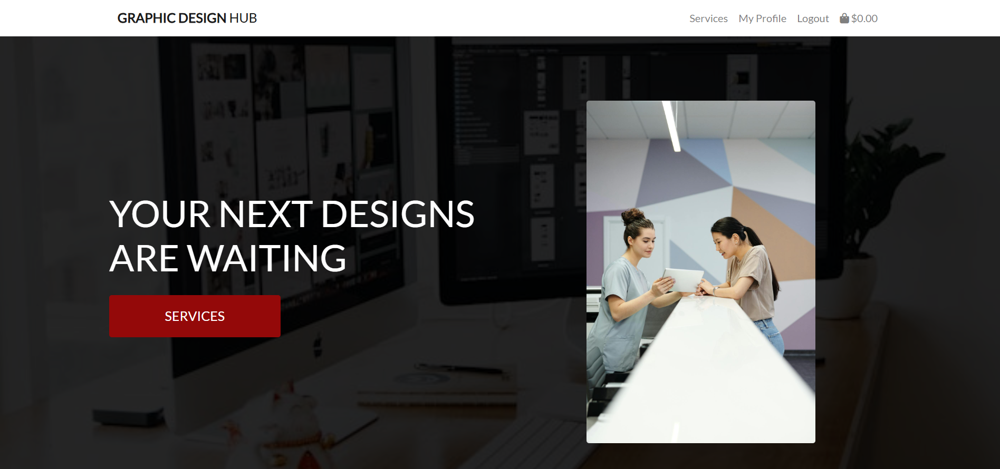

# Graphic Design Hub 

## Introduction  

Graphic Design Hub is a full-stack Django web application that allows users to browse professional design services, add them to a shopping cart, and securely pay using Stripe.  

It is aimed at individuals and small businesses who want affordable, custom designs such as logos, posters, flyers, and social media graphics. The project provides a streamlined way to order designs online and receive completed files directly through their account.  

This project was developed to demonstrate the integration of an e-commerce system, database models, authentication, cloud deployment, and SEO techniques.  

---

## Features  

- **Home Page Hero Section**  
  - Clear call-to-action leading users to services.  
  - Responsive, image-based layout designed for accessibility and mobile devices.  
  

- **Service Catalog**  
  - List of design services with name, description, price, and optional image.  
  - Images stored on AWS S3 and displayed dynamically.  
  - Admin can add, edit, and remove services.  

- **Shopping Cart & Checkout**  
  - Add services to a cart, update quantities, and remove items (full CRUD).  
  - Integrated Stripe checkout with payment intent confirmation.  
  - Secure payment processing and order recording in the database.  
  - Checkout provides clear feedback messages for successful and unsuccessful payments.  

- **Order Management**  
  - Users can upload design requirements (files and notes) when checking out.  
  - Admin can upload completed design files, which users download securely.  
  - Orders have clear statuses: pending, in progress, or completed.  

- **User Authentication**  
  - Register, login, and logout via Django Allauth.  
  - Role-based access: admin sees management options, users see profile/orders.  
  - Secure profile area with active orders, completed orders, and downloads.  

- **Profile Page**  
  - Displays active orders with edit/delete options (if not locked).  
  - Completed orders show downloadable final files.  
  - Includes an external resources section with links to printing services (e.g., [Vistaprint](https://www.vistaprint.co.uk/)) to add extra value.  

- **Forms**  
  - Validated forms used across the application, including:  
    - User registration and login.  
    - Checkout forms for payment and file uploads.  
    - Profile/order editing forms.  
  - All forms styled with crispy-forms for accessibility and consistent design.  

- **SEO Enhancements**  
  - Meta descriptions and keywords in templates.
  - SEO friendly descriptions for all services.
    
  - Sitemap.xml and robots.txt included.  
  - Custom 404 error page for better user experience.  
  - External links for improved authority signals.  
  

- **Marketing Features**  
  - Newsletter signup form for email capture.  
      
  
  - Facebook Business Page created for brand reach.  
      

- **Responsive Frontend**  
  - Built with Bootstrap 4 and custom CSS for a modern, consistent design.  
  - Accessible forms styled with crispy-forms.  

- **Testing**  
  - Automated Django unit tests created for models, views, cart, and webhooks.  
  - All tests passed successfully, confirming functionality works as intended.  

- **Code Quality & Logic**  
  - Clean code practices followed, with meaningful variable names and no unused/commented code.  
  - Includes custom Python logic using conditionals and loops (e.g., cart calculations, webhook event handling).  

- **Deployment**  
  - Hosted on Heroku with PostgreSQL database.  
  - Static and media files stored on AWS S3.  
  - Version controlled via GitHub with regular commits.  
  - Environment variables used to hide secret keys and ensure security.  

- **Project Management**  
  - User stories and project tasks tracked in an Agile workflow using GitHub Projects.  
  - Features were planned, implemented, and tested iteratively.  

## Planning

Wireframes that were used to plan out the layout and flow between pages.

## Technologies Used  

This project was built using the following technologies:

### Frontend
- **HTML5** – semantic structure of the web pages.  
- **CSS3 / Bootstrap 4** – responsive design, layout, and styling.  
- **JavaScript** – interactive elements and Stripe integration.  

### Backend
- **Python** – programming language used for all backend logic.  
- **Django 5** – web framework providing MVC structure, models, forms, and views.  
- **Django AllAuth** – authentication and registration system for user accounts.  
- **Django Storages & AWS S3** – cloud storage for static and media files.  
- **Stripe API** – secure payment processing and webhook handling.  

### Database
- **PostgreSQL (Heroku Postgres)** – relational database for storing users, services, and orders.  

### Deployment
- **Heroku** – cloud hosting platform where the project is deployed.  
- **Gunicorn** – WSGI HTTP server for running Django in production.  
- **Whitenoise** – serves static files efficiently in production.  

### Version Control
- **Git** – local version control.  
- **GitHub** – remote repository and collaboration platform.  

### Others
- **AWS S3 Bucket** – cloud storage for media/service images and customer uploads.  
- **Crispy Forms + Bootstrap4** – enhanced rendering of Django forms.  
- **dotenv** – secure environment variable management.  

## Database Schema

The application uses a relational database schema built with Django ORM.  
It follows a clean separation between users, services, and orders.

### Key Models
- **User**: Built-in authentication system for account management.
- **Profile**: Extends each user with additional profile information (One-to-One relationship).
- **Service**: Represents a design service (e.g., logo, poster, brochure) offered in the store.
- **Order**: Created when a user checks out. Linked to a User.
- **OrderItem**: Connects an Order with one or more Services. Supports multiple services per order.
- **OrderUpload**: Stores files uploaded by users for their order (e.g., design briefs, images).

### Relationships
- **User → Profile**: One-to-One  
- **User → Order**: One-to-Many (a user can place multiple orders)  
- **Order → OrderItem**: One-to-Many (an order can contain multiple services)  
- **Service → OrderItem**: One-to-Many (a service can be part of many orders)  
- **OrderItem → OrderUpload**: One-to-Many (each order item can have multiple uploaded files)

### Diagram
![Database Schema]
