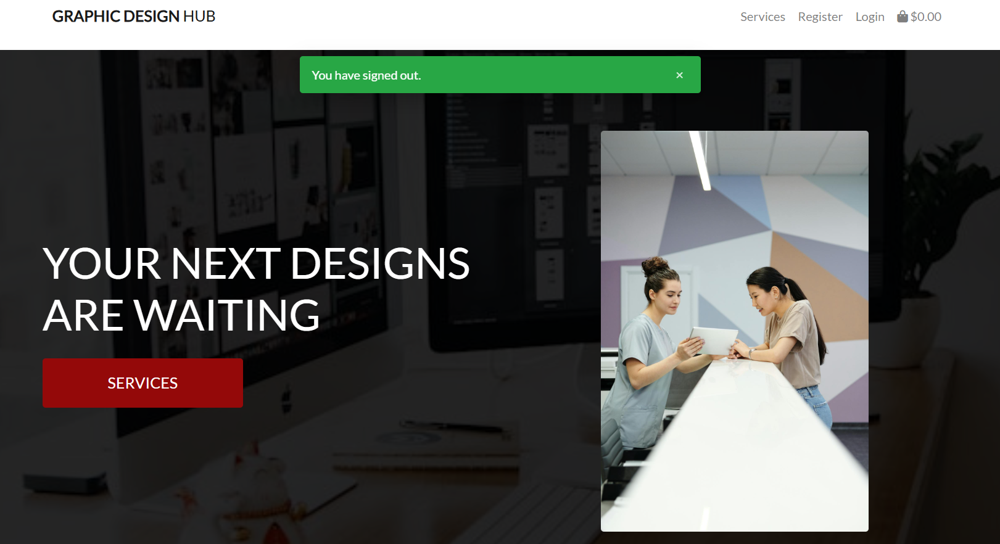
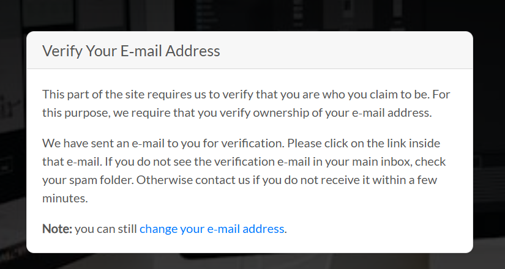
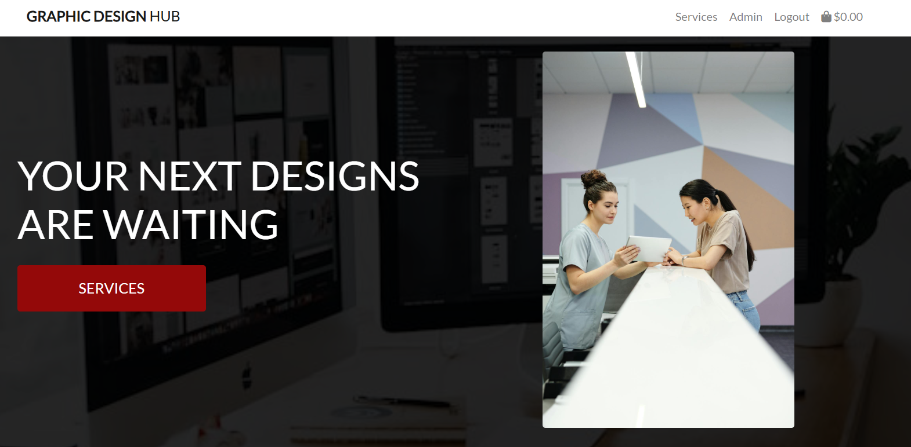
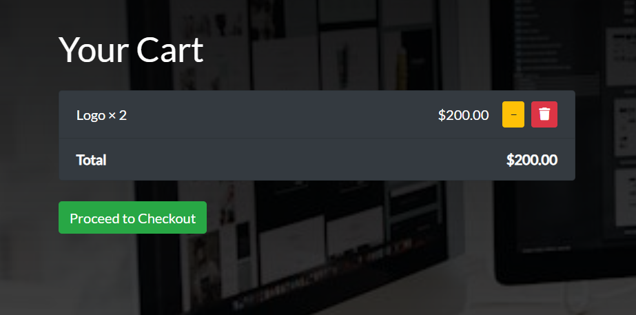
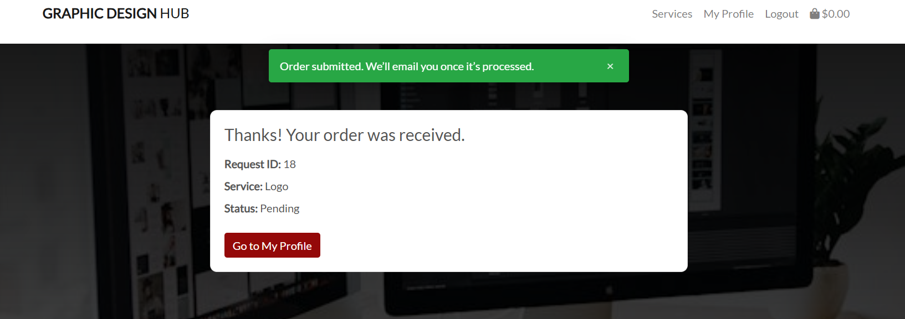
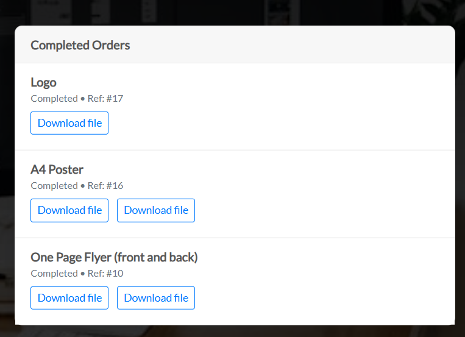

# Graphic Design Hub 

## Introduction  

Graphic Design Hub is a full-stack Django web application that allows users to browse professional design services, add them to a shopping cart, and securely pay using Stripe.  

It is aimed at individuals and small businesses who want affordable, custom designs such as logos, posters, flyers, and social media graphics. The project provides a streamlined way to order designs online and receive completed files directly through their account.  

This project was developed to demonstrate the integration of an e-commerce system, database models, authentication, cloud deployment, and SEO techniques.  

---

## Features  

- **Home Page Hero Section**  
  - Clear call-to-action leading users to services.  
  - Responsive, image-based layout designed for accessibility and mobile devices.  
  

- **Service Catalog**  
  - List of design services with name, description, price, and optional image.  
  - Images stored on AWS S3 and displayed dynamically.  
  - Admin can add, edit, and remove services.  

- **Shopping Cart & Checkout**  
  - Add services to a cart, update quantities, and remove items (full CRUD).  
  - Integrated Stripe checkout with payment intent confirmation.  
  - Secure payment processing and order recording in the database.  
  - Checkout provides clear feedback messages for successful and unsuccessful payments.  

- **Order Management**  
  - Users can upload design requirements (files and notes) when checking out.  
  - Admin can upload completed design files, which users download securely.  
  - Orders have clear statuses: pending, in progress, or completed.  

- **User Authentication**  
  - Register, login, and logout via Django Allauth.  
  - Role-based access: admin sees management options, users see profile/orders.  
  - Secure profile area with active orders, completed orders, and downloads.  

- **Profile Page**  
  - Displays active orders with edit/delete options (if not locked).  
  - Completed orders show downloadable final files.  
  - Includes an external resources section with links to printing services (e.g., [Vistaprint](https://www.vistaprint.co.uk/)) to add extra value.  

- **Forms**  
  - Validated forms used across the application, including:  
    - User registration and login.  
    - Checkout forms for payment and file uploads.  
    - Profile/order editing forms.  
  - All forms styled with crispy-forms for accessibility and consistent design.  

- **SEO Enhancements**  
  - Meta descriptions and keywords in templates.
  - SEO friendly descriptions for all services.
    
  - Sitemap.xml and robots.txt included.  
  - Custom 404 error page for better user experience.  
  - External links for improved authority signals.  
  

- **Marketing Features**  
  - Newsletter signup form for email capture.  
      
  
  - Facebook Business Page created for brand reach.  
      

- **Responsive Frontend**  
  - Built with Bootstrap 4 and custom CSS for a modern, consistent design.  
  - Accessible forms styled with crispy-forms.  

- **Testing**  
  - Automated Django unit tests created for models, views, cart, and webhooks.  
  - All tests passed successfully, confirming functionality works as intended.  

- **Code Quality & Logic**  
  - Clean code practices followed, with meaningful variable names and no unused/commented code.  
  - Includes custom Python logic using conditionals and loops (e.g., cart calculations, webhook event handling).  

- **Deployment**  
  - Hosted on Heroku with PostgreSQL database.  
  - Static and media files stored on AWS S3.  
  - Version controlled via GitHub with regular commits.  
  - Environment variables used to hide secret keys and ensure security.  

- **Project Management**  
  - User stories and project tasks tracked in an Agile workflow using GitHub Projects.  
  - Features were planned, implemented, and tested iteratively.  

## Planning

Wireframes that were used to plan out the layout and flow between pages.

  

## Database Schema

The application uses a relational database schema built with Django ORM.  
It follows a clean separation between users, services, and orders.

### Key Models
- **User**: Built-in authentication system for account management.
- **Profile**: Extends each user with additional profile information (One-to-One relationship).
- **Service**: Represents a design service (e.g., logo, poster, brochure) offered in the store.
- **Order**: Created when a user checks out. Linked to a User.
- **OrderItem**: Connects an Order with one or more Services. Supports multiple services per order.
- **OrderUpload**: Stores files uploaded by users for their order (e.g., design briefs, images).

### Relationships
- **User → Profile**: One-to-One  
- **User → Order**: One-to-Many (a user can place multiple orders)  
- **Order → OrderItem**: One-to-Many (an order can contain multiple services)  
- **Service → OrderItem**: One-to-Many (a service can be part of many orders)  
- **OrderItem → OrderUpload**: One-to-Many (each order item can have multiple uploaded files)

### Diagram

## UX & Design  

### Design Goals  
The aim of Graphic Design Hub was to provide a **clear, professional, and easy-to-use platform** for customers to order custom design services online.  

The design choices were based on three key goals:  
- **Clarity**: clean navigation and simple layout so users can find services quickly.  
- **Trust**: professional look, secure payment system, clear order statuses.  
- **Accessibility**: mobile-first responsive design and accessible forms.  

### Layout & Navigation  
- A consistent **navbar** is present on all pages, linking to home, services, cart, and profile.  
- A **footer** provides branding and external links to social media and resources.  
- The **profile page** shows active and completed orders in a dashboard-style layout.  

### Visual Design Choices  
- **Colour scheme**: a dark background with white text and red and blue accents. 
- **Typography**: Lato font for a modern, clean feel.  
- **Hover effects** on cards and buttons add interactivity and encourage engagement.  
- **Hero section** with a bold headline and CTA button (“Services”) on the homepage. 

### Responsiveness  
- The site was tested on multiple devices and browsers to confirm usability.  
- The layout adapts for smaller screens by collapsing the navbar and stacking content vertically.  
- The footer sticks to the bottom of the viewport for a professional finish.  

## Testing  

### Automated Testing (Unit Tests)  

I created a set of Django unit tests to verify that key functionality of the application works correctly.  
The tests are stored inside the `tests.py` files of the relevant apps:  

- [Accounts](https://github.com/JohnnysavageNI/graphic_design_hub/blob/main/accounts/tests.py/) 
- [Cart](https://github.com/JohnnysavageNI/graphic_design_hub/blob/main/cart/tests.py)
- [Home](https://github.com/JohnnysavageNI/graphic_design_hub/blob/main/home/tests.py)
- [Orders](https://github.com/JohnnysavageNI/graphic_design_hub/blob/main/orders/tests.py)
- [Forms](https://github.com/JohnnysavageNI/graphic_design_hub/blob/main/orders/tests_forms.py)
- [Services](https://github.com/JohnnysavageNI/graphic_design_hub/blob/main/services/tests.py)

To run all tests, I used the following command:  

python manage.py test

All tests completed successfully.

### Manual Testing  

1. **User Login**  
   - Steps:  
     1. Click login in nav bar.  
     2. Enter valid user credentials.  
   - Expected Result: User is logged in and redirected to the home page. Navigation bar updates to show `Logout` and `My Profile`.  
   - Actual Result: Worked as expected.  
   

2. **User Logout**  
   - Steps:  
     1. While logged in, click `Logout` in the navigation bar.  
   - Expected Result: User is logged out, redirected to the home page, and navigation shows `Login` and `Register` again.  
   - Actual Result: Worked as expected.  
   

3. **User Registration (with Email Confirmation)**  
   - Steps:  
     1. Navigate to Register in nav bar.  
     2. Fill in fields.  
     3. Confirm email via link sent.  
   - Expected Result: New account is created, email confirmation link activates account, user can log in.  
   - Actual Result: Worked as expected.  
   
   

4. **Admin Login Shows Admin Nav Link**  
   - Steps:  
     1. Log in as a superuser.  
     2. Observe navigation bar.  
   - Expected Result: Admin-only link (`Admin`) appears in the navigation bar.  
   - Actual Result: Worked as expected.  
   

5. **Decrease Quantity and Delete Items in Cart**  
   - Steps:  
     1. Add a service to the cart.  
     2. Go to `/cart/`.  
     3. Decrease item quantity or click `Remove`.  
   - Expected Result: Cart updates totals correctly. If all items removed, cart shows as empty.  
   - Actual Result: Worked as expected. 
    

6. **Successful Order**  
   - Steps:  
     1. Add service(s) to cart.  
     2. Proceed to checkout.  
     3. Enter Stripe test card details (`4242 4242 4242 4242`) and submit.  
   - Expected Result: Payment is successful, order is saved to database, and user sees a success message.  
   - Actual Result: Worked as expected.  
   

7. **Stripe Webhooks Verified in Developer Dashboard**  
   - Steps:  
     1. Place a successful test order.  
     2. Log into Stripe.  
     3. Check event deliveries for the application’s endpoint (`/orders/wh/`).  
   - Expected Result: Webhook events (e.g., `payment_intent.succeeded`) are delivered and acknowledged (`200 OK`).  
   - Actual Result: Worked as expected.  
   

8. **Edit Instructions for an Order/Delete an Order (Profile Page)**  
   - Steps:  
     1. Log in as a user with a pending order.  
     2. Navigate to `My Profile`.  
     3. Edit instructions for an active order.  
     4. Delete an active order
   - Expected Result: Updated instructions are saved and visible in profile/order details. Deleted order disappears.  
   - Actual Result: Worked as expected.  
     

9. **Admin Completes an Order and Uploads Finished Work**  
    - Steps:  
      1. Log in as an admin and navigate to `/admin/`.  
      2. Open an order, change status to `Completed`, and upload a finished design file.  
    - Expected Result: Order is marked as completed and file is attached to the order.  
    - Actual Result: Worked as expected.  
    

10. **User Downloads Completed Work from Profile Page**  
    - Steps:  
      1. Log in as the user who placed the order.  
      2. Navigate to `My Profile` → Completed Orders.  
      3. Click `Download` button for the uploaded design file.  
    - Expected Result: File downloads successfully from AWS S3.  
    - Actual Result: Worked as expected.  
    

11. **Mailchimp Newsletter Subscribe**  
    - Steps:  
      1. Scroll to footer.  
      2. Enter an email in the Mailchimp subscribe form.  
    - Expected Result: Success feedback message appears confirming subscription.  
    - Actual Result: Worked as expected.  
    

12. **Custom 404 Page**  
    - Steps:  
      1. Navigate to a non-existent URL, e.g., `/test`.  
    - Expected Result: Custom 404 page is displayed with friendly error message and redirect option.  
    - Actual Result: Worked as expected.  
    

## Deployment  

### Hosting  
This project is hosted on **Heroku** using a PostgreSQL database.  
Static and media files are stored on **AWS S3** for scalability and reliability.  

### Environment Variables  
The following environment variables must be set (in Heroku or a local `.env` file):  

- `SECRET_KEY` – Django secret key  
- `DEBUG` – set to `False` in production  
- `DATABASE_URL` – PostgreSQL database URL (Heroku provides this automatically)  
- `STRIPE_PUBLIC_KEY` – Stripe publishable key  
- `STRIPE_SECRET_KEY` – Stripe secret key  
- `STRIPE_WH_SECRET` – Stripe webhook signing secret  
- `AWS_ACCESS_KEY_ID` – AWS IAM user key  
- `AWS_SECRET_ACCESS_KEY` – AWS IAM user secret  
- `USE_AWS` – set to `True` in production  

### AWS S3 Setup  
1. Create an S3 bucket in your chosen AWS region.   
2. Create an IAM user with programmatic access and attach the `AmazonS3FullAccess` policy.  
3. Add bucket name and region into Django settings.  
4. Configure `custom_storages.py` for static and media storage.  

### Heroku Deployment Steps
- Create a new Heroku app.
- Connect Heroku to GitHub repo.
- Set environment variables including DATABASE_URL and SECRET_KEY.
- Add required buildpacks (Python).
- Push code to Github.
- Run python manage.py migrate, createsuperuser, and collectstatic.

[Live Link](https://graphic-design-hub-5b62ec6c28b6.herokuapp.com/)

## Technologies Used  

- **Backend**: Python, Django, PostgreSQL (Heroku)  
- **Frontend**: HTML5, CSS3, Bootstrap 4, JavaScript, jQuery  
- **Authentication**: Django Allauth (registration, login, email verification)  
- **Payments**: Stripe (Checkout + Webhooks)  
- **Storage & Hosting**: Heroku (deployment), AWS S3 (static/media files)  
- **Forms & Styling**: Django Crispy Forms with Bootstrap 4  
- **Version Control**: Git & GitHub  
- **Other Tools**: Mailchimp (newsletter), Facebook Business Page, GitHub Projects (Agile management)  

### Credits

- Fonts from [Google Fonts](https://fonts.google.com/)
- Favicon from [RealFaviconGenerator](https://realfavicongenerator.net/)
- [Code Institute](https://codeinstitute.net/) project 'Boutique Ado' was used as inspiration.
- Icons from [Font Awesome](https://fontawesome.com/) 
- Images for services came from [Mockups-Design](https://mockups-design.com/)
- Background image and home image both came from [Pexels](https://www.pexels.com/)